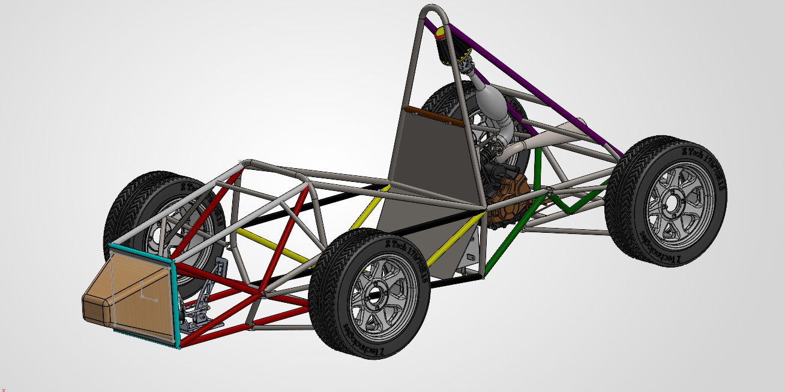
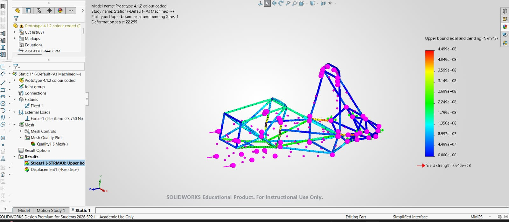
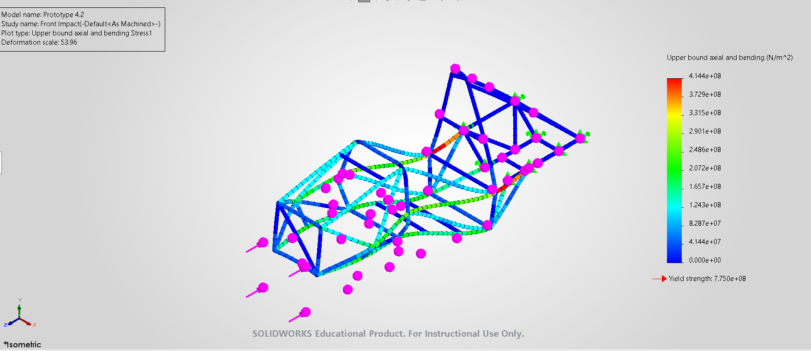
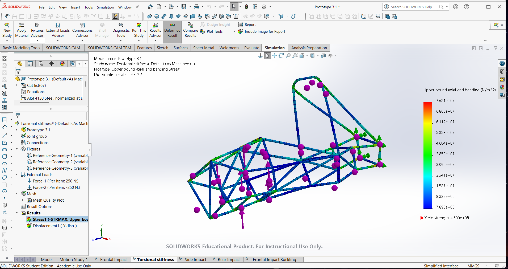
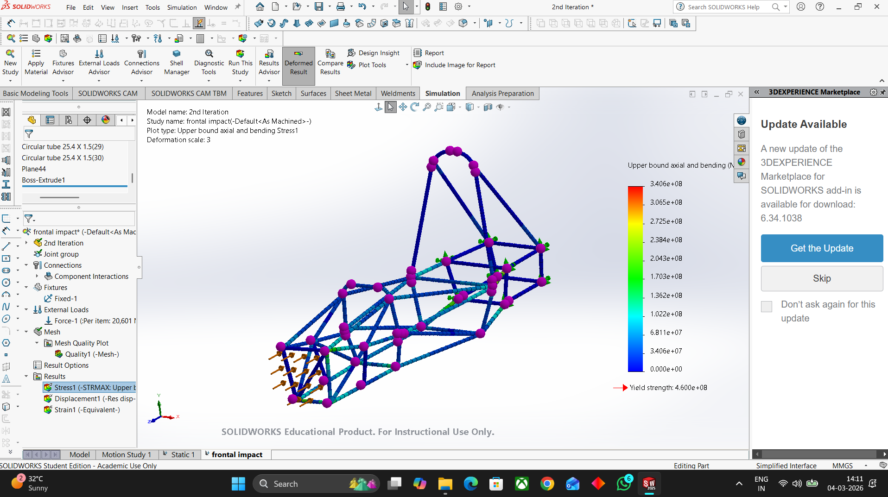

# Formula-Student-Chassis-FEA
AISI 4130 spaceframe chassis for a Formula Student car, with FEA for frontal impact, rear impact and torsional stiffness (29.3 kg, FOS 1.70).
# Formula Student Chassis: Design and FEA Validation

Structural design and validation of the **AISI 4130 chromoly spaceframe** for **UVEGA Motorsports**, UVCE's first Formula Student team, built for Formula Bharat and Supra SAE 2027.

**Headline:** chassis mass cut from **35 kg to 29.3 kg (-16.3%)** across prototypes, with a frontal impact factor of safety of about **1.70** under the 95 kN rules load.

| | |
|---|---|
| **Material** | AISI 4130 steel tube |
| **Tools** | SolidWorks, SolidWorks Simulation, ANSYS Mechanical |
| **Rules basis** | Formula Bharat (frontal impact load per T3.18) |
| **Team role** | Founder and team lead, 40 members across 6 subsystems |

---

## What this project shows

1. A **design loop, not a single run**: four analysed iterations of the frame, with stress plots kept for each.
2. **Rules-driven loading**: the frontal case uses the 95 kN load from the Formula Bharat rules (4 x 23,750 N).
3. **Cross-checking between solvers**: SolidWorks and ANSYS results were compared, and a roughly 20% stress difference was traced to a connectivity defect in the shared topology, not to real physics.
4. **Fixing what the analysis found**: an overstressed front hoop was identified in frontal impact and redesigned.

## Method

- The frame is modelled as a **beam-element (weldment) structure** with joint groups at the tube nodes. Plots show *upper bound axial and bending stress*, which is the conservative combined stress SolidWorks reports for beams.
- Fixtures (green) and loads (arrows) are visible on each plot below, and the loads are listed in the results table.
- Factor of safety on each plot = yield strength shown on the plot / maximum stress on the plot.

## Results by iteration

Values below are read directly from the screenshots in this repo. Note that the yield strength differs between studies because the material setting changed between iterations, so compare each row against its own yield.

| Iteration | Study | Load per item | Max stress | Yield used | FOS |
|---|---|---|---|---|---|
| 2nd iteration | Frontal impact | 20,601 N | 340.6 MPa | 460 MPa | 1.35 |
| Prototype 3.1 | Torsional stiffness | +/-250 N | 76.2 MPa | 460 MPa | 6.0 |
| Prototype 4.1.2 | Frontal impact (95 kN total) | 23,750 N | 449.9 MPa | 764 MPa | **1.70** |
| Prototype 4.2 | Front impact | 23,750 N | 414.4 MPa | 775 MPa | 1.87 |

Additional results from the validated design:

| Check | Result |
|---|---|
| Rear impact | FOS 2.56 |
| Torsional stiffness | 3,500.86 Nm/deg |
| Chassis mass | 29.3 kg |

*The rear impact and torsional stiffness plots for the final design will be added to this repo.*

## Analysis screenshots

### Frontal impact, 95 kN (Prototype 4.1.2)
Peak stress of 449.9 MPa against a 764 MPa yield gives a factor of safety of about 1.70.

### Front impact (Prototype 4.2)

### Torsional stiffness (Prototype 3.1)
Equal and opposite 250 N loads twist the frame; stiffness is calculated from the resulting deflection.

### Design history: 2nd iteration
An early frontal impact run, kept to show how the frame evolved.

## Limitations and next steps

- Beam models capture frame-level load paths well but not local stress at welded joints. Critical nodes need solid or shell submodels.
- A frontal impact buckling study exists for this design and will be documented here.
- Next: add the final rear impact and torsion plots.

## Related projects

- [Double-Wishbone-Kinematics](https://github.com/Krishna-Ram9/Double-Wishbone-Kinematics): Python 4-bar linkage solver for this car's suspension
- [GE Jet Engine Bracket Topology Optimization](https://github.com/Krishna-Ram9/GE-Jet-Engine-bracket-topology-optimization): FEA and mesh convergence study

